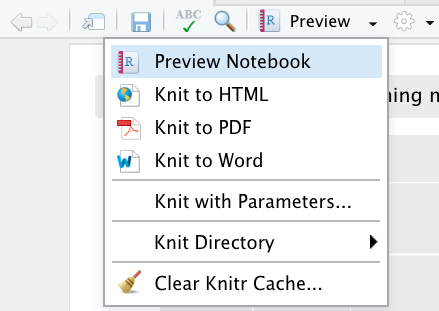

# Inhoud

In deze howto pagina worden de volgende onderwerpen besproken:

- [R studio installeren](#r-studio-installeren)
- [Notebooks en data importeren](#notebook-en-data-importeren)
- [Notebooks exporteren](#notebooks-exporteren)

---

## R studio installeren

## Notebook en data importeren

In R gebruiken we eigenlijk altijd zogenaamde Notebooks. Dat zijn .Rmd (RMarkdown)
bestanden waar je uitleg, code (chunks) & output samen kunt voegen. Dit zorgt o.a.
voor herhaalbaarheid en leesbaarheid van je stappen, een hele verbetering t.o.v.
data analyse in MS Excel. Rstudio opent standaard niet met een Notebook. Dat moet
je zelf uploaden of aanmaken als je aan de slag gaat.

Download uit canvas het bestand `Rode Schoentjes - Data Analysis.rmd` en het
databestand `Rode Schoentjes - Data.zip`. Volg de instructies hieronder voor het
openen van het notebook en beschikbaar krijgen van de data.

- **Online versie:**\
  Heb je de online versie van R-studio, kies rechtsonder in het scherm voor de
  tab _Files_. Klik op de knop _Upload_. Browse naar de de map "downloads" en
  selecteer het Rmd-bestand. Als je op "ok" klikt, wordt het document ingeladen
  en zie je het tussen de bestanden staan. Klik erop en je dan wordt het
  zichbaar in het scherm linksboven. Voor het ophalen van de data klik je nog
  een keer op de knop _Upload_. Nu open je het zip bestand
  `Rode Schoentjes - Data.zip`. R-studio zal het zip-bestand uitpakken en de
  databestanden los in het bestandsoverzicht zetten.

- **Lokale installatie:**\
  Als je R studio op je pc geïnstalleerd hebt, open je het bestand via het menu
  _File_/_Open_. Ga naar de map met downloads en open het Rmd-bestand. De
  databestanden zijn in dit geval beschikbaar in de map Downloads op je pc.
  Vraag hulp aan je docent om de bestanden op de goede plaats neer te zetten.
  Mogelijk moet de code van het notebook worden aangepast om de data succesvol
  in te lezen.

---

## Notebooks exporteren

Je kunt via R studio je Notebooks naar verschillende bestandsformaten: als HTML file of als PDF.
Belangrijk hierbij is om te weten wat er dan eigenlijk gebeurt en wat je moet checken.

Voor de uitvoer exporteren naar PDF heb je een aparte package nodig. Heb je die niet geïnstalleerd, dan krijg je de volgende foutmelding:
  
Installeer die package vanaf de console met het commando `tinytex::install_tinytex()`.

Als je op Knit to _..._ klikt zie je de exportformaten waarin je uitvoer kan worden geëxporteerd:
  
Bij het exporteren worden alle chunks achter elkaar uitgevoerd. Deze uitvoer wordt opgeslagen in een bestand in dezelfde directory als waar je .Rmd bestand staat.

Dingen waar je op moet letten, omdat dit fouten kan voorkomen:

- Alle **file referenties** voor bijvoorbeeld importeren van je dataset moeten kloppen! Alle files worden gezocht relatief t.o.v. de locatie waar je Notebook zich bevindt.
- Je zult expliciet een bestand, database of andere bron voor je dataset moeten laden in je Notebook via bijvoorbeeld de read_excel functie (alleen via het menu importeren en de data in het werkgeheugen van RStudio hebben staan werkt niet als je een Notebook knit).
- Foutmelding wijzen je vaak op potentiele issues, lees ze dus goed en Google eventueel wat ze betekenen. Er is een aantal functies die het wel doen als je je Notebook met de hand uitvoert, maar niet als je je Notebook knit (zoals de functie 'View').
- Notebooks waarbij authenticatie een rol speelt (API's) zijn tricky om te exporteren. Als een export draait, is er **geen interactie** mogelijk. Je moet je Notebook dan dus zo configureren dat er geen authenticatie o.i.d. nodig is.
- Om naar PDF te exporteren heb je een aparte package nodig. Heb je die niet, dan krijg je waarschijnlijk deze fout als je het toch probeert:
